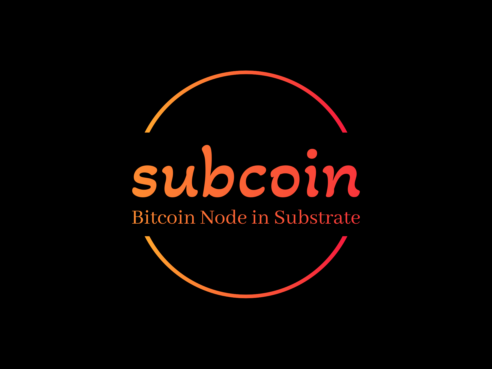

<div align="center">

<p align="center"></p>

[](https://github.com/subcoin-project/subcoin/actions/workflows/ci.yml)
[](https://github.com/subcoin-project/subcoin/actions/workflows/docs.yml)
[](https://subcoin-project.github.io/subcoin/book)

</div>

> [!WARNING]
>
> Subcoin is currently in its early development stages and is not yet ready for production use.
> See [the disclaimer below](#disclaimer).

## Overview

Subcoin is a full node implementation of Bitcoin in Rust, built using the Substrate framework.
By leveraging Substrate's modular and flexible architecture, Subcoin aims to offer a robust
and performant implementation of Bitcoin protocol. It is the first Bitcoin client that
introduces the snap (fast) sync into the Bitcoin ecosystem, a syncing strategy common in
newer blockchains (Ethereum, Polkadot, Near, etc) with a global chain state.

## Features

- 🔄 **Snap Sync**. Employs Substrate's advanced state sync strategy, enabling Bitcoin snap sync
by downloading all headers and the state at a specific block, in decentralized manner. This allows
new users to quickly sync to the latest state of the Bitcoin chain by running a Subcoin node.
<!-- TODO: add a rough snap syncing time later -->

- 🔗 **Substrate Integration**. Utilizes Substrate framework to provide production-level blockchain infrastructures.

## Development Status

Currently, Subcoin tentatively implements the feature of syncing as a Bitcoin full node. It is not yet
capable of participating in the Bitcoin consensus as a miner node. Please note that Subcoin is not stable
and is still under active development. Additional features and improvements are in the planning stages.

## Run Tests

```bash
cargo test --workspace --all
```

## Disclaimer

**Do not use Subcoin in production.** It is a heavy work in progress, not feature-complete and the code
has not been audited as well. Use at your own risk.

## Contributing

Contributions to Subcoin are welcome! If you have ideas for improvements, bug fixes, or new features,
feel free to open an issue or submit a pull request. Make sure to follow the contribution guidelines
and code of conduct when contributing to the project.

## License

Subcoin is licensed under the [MIT License](LICENSE). See the LICENSE file for information.
