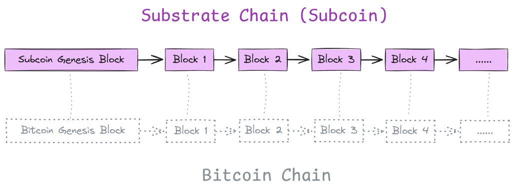

# Architecture

## Overview

Subcoin operates similarly to how a Layer 2 chain is derived from a Layer 1 chain in a modular blockchain architecture. Each Subcoin block is deterministically derived from the corresponding Bitcoin block at the same height, faithfully replicating Bitcoin's transaction logic (Money Transfer).

The Bitcoin state (UTXO Set) is embedded within the Subcoin state, which includes a commitment to the global chain state (`state_root`). Effectively, Subcoin functions like Bitcoin with an added state root for the global Bitcoin state. This `state_root` enables possibilities like decentralized fast sync, without requiring any modifications to the Bitcoin protocol.

Additionally, Subcoin serves as an ideal testbed for new Bitcoin features, which are often challenging to land on the Bitcoin mainnet due to its stability and conservative development process. Developers can experiment with new innovations and features on Subcoin in a live environment without affecting the Bitcoin mainnet.

Subcoin is not a new blockchain but a replica of the Bitcoin chain with additional functionality, such as decentralized fast sync and flexibility for testing new features.

## Code Map

This section provides a brief overview of key directories and data structures in the project.

### `crates/pallet-bitcoin`

This pallet is responsible for tracking the state of the UTXO Set. Transaction verification is deliberately excluded from this pallet, with all verifications handled on the client side through `sc-consensus-nakamoto`.

### `crates/sc-consensus-nakamoto`

This crate manages the processing and importing of Bitcoin blocks into the database, whether they are sourced from a local Bitcoin Core database or downloaded via the P2P network.

- `BitcoinBlockImporter`: Processes and imports blocks into the database.
- `BlockImportQueue`: Bridges blocks downloaded from the Bitcoin P2P network to BitcoinBlockImporter.

### `crates/subcoin-network`

This crate handles downloading Bitcoin blocks from the Bitcoin P2P network. The downloaded blocks are sent to the import queue, running in a separate task for processing. Block processing results are communicated back to ensure seamless integration.

### `crates/subcoin-runtime`

This is a minimal Substrate runtime, composed of `frame-system` and `pallet-bitcoin`, which defines the core business logic of Subcoin chain.

### `crates/subcoin-node`

The entry point for the Subcoin node is located at `crates/subcoin-node/src/bin/subcoin.rs`, which initializes and runs the node.
